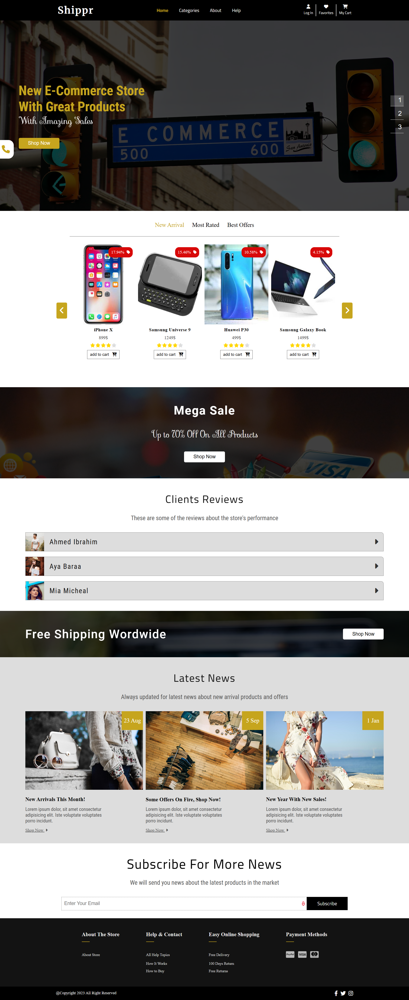
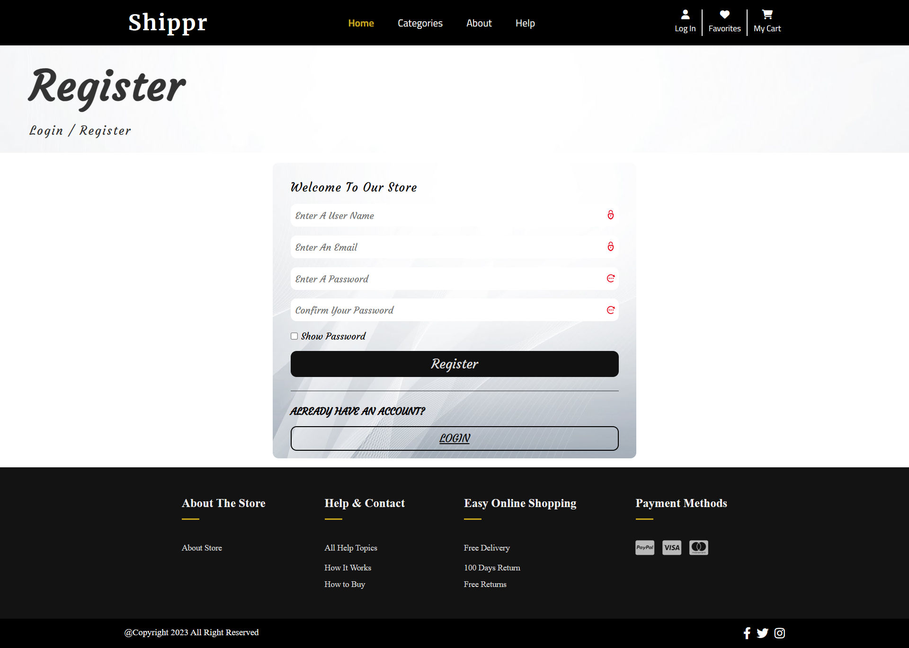
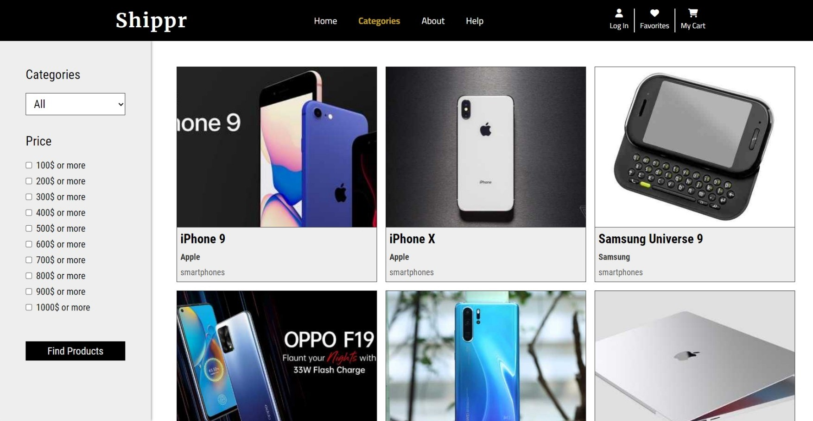
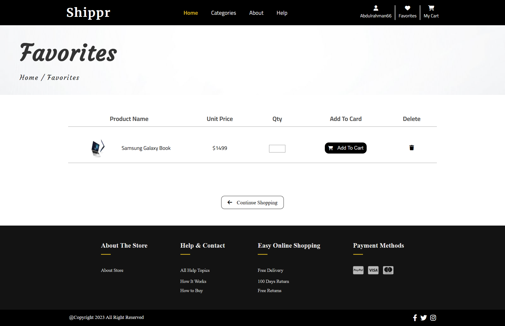
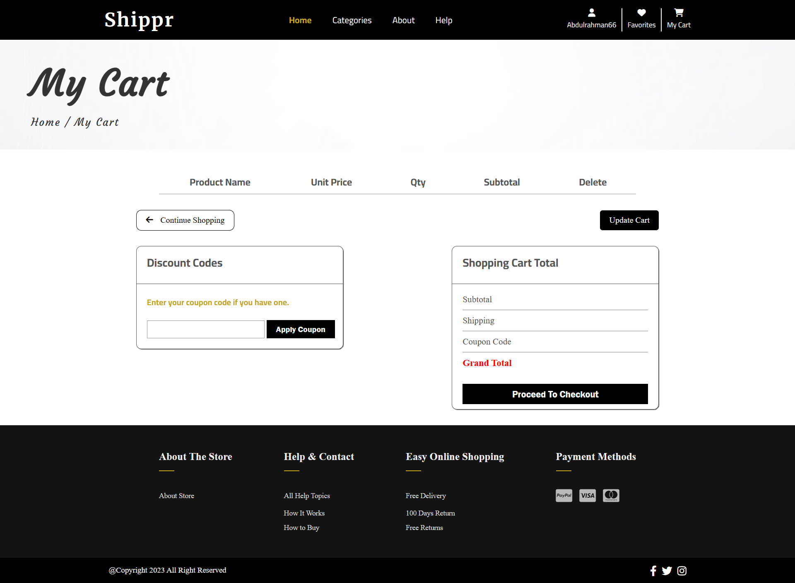
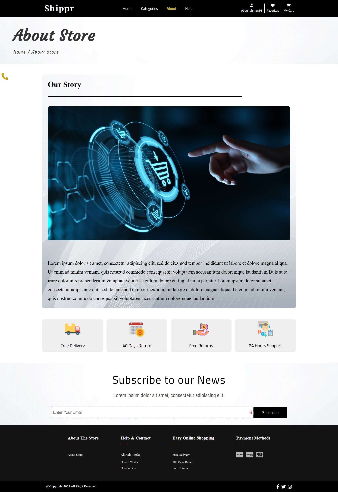
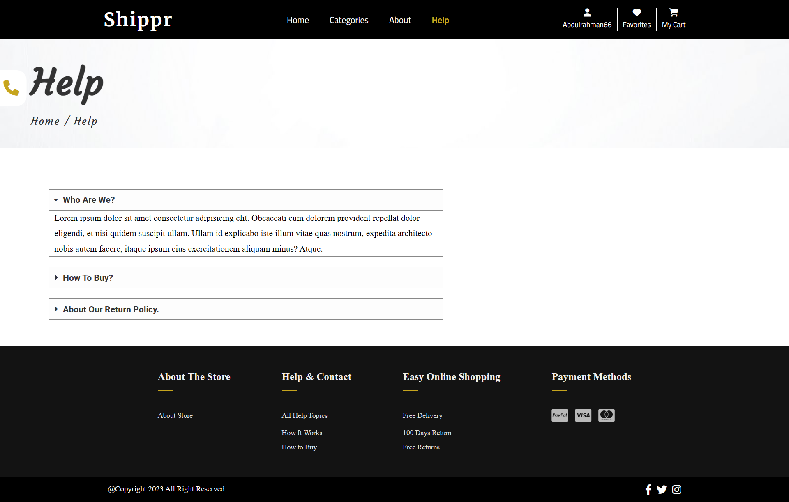
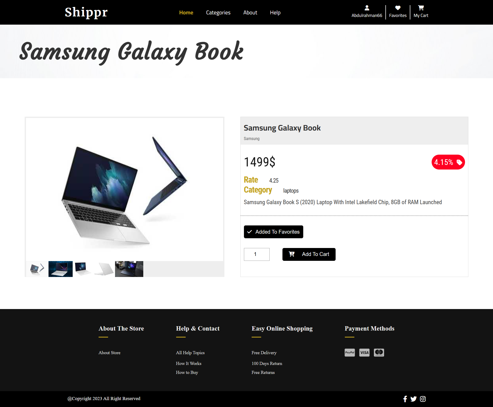

# shippr_ecommerce-store

My e-commerce website is a dynamic platform for buying and selling a wide range of goods over the internet. It provides users with a seamless and highly secure payment processing system, ensuring that all transactions are handled with the utmost accuracy and safety.

## Features

- Responsive and interactive User Interfaces
- Enhanced User Experience
- Secure Authentication system
- Categories page with filtering system
- Add Products to Favorites List
- Add Products to The Cart

## Future Work

- Add Search system to the categories page.
- Add payment page.
- Send Message to the user email when receiving the product in time.

## Screenshots

#### Home

#### Sign In

#### Register

#### Categories

#### Favorites

#### Cart

#### About

#### Help

#### Product

## Tools

- HTML - HTML5
- CSS - CSS3
- JavaScript
- Pug
- Sass/SCSS
- GulpJs

---

## 🚀 About Me

Junior Front-end developer with a history of creating engaging, user-friendly websites with proven success. Developed modern websites with advanced features, showcasing technical excellence. Motivated to stay up-to-date with industry trends and best practices. Aspiring to be a Full-stack developer with a strong determination and passion for coding.

## 🛠 Skills

- HTML/HTML5
- CSS/CSS3
- JavaScript
- Object Oriented Programming (OOP)
- Sass\SCSS
- Pug
- GulpJs
- BootStrap
- Material UI
- React.js
- React ecosystems (React Router - React Redux - React Query)
- Redux - Redux Toolkit
- Firebase

## 🔗 Links

